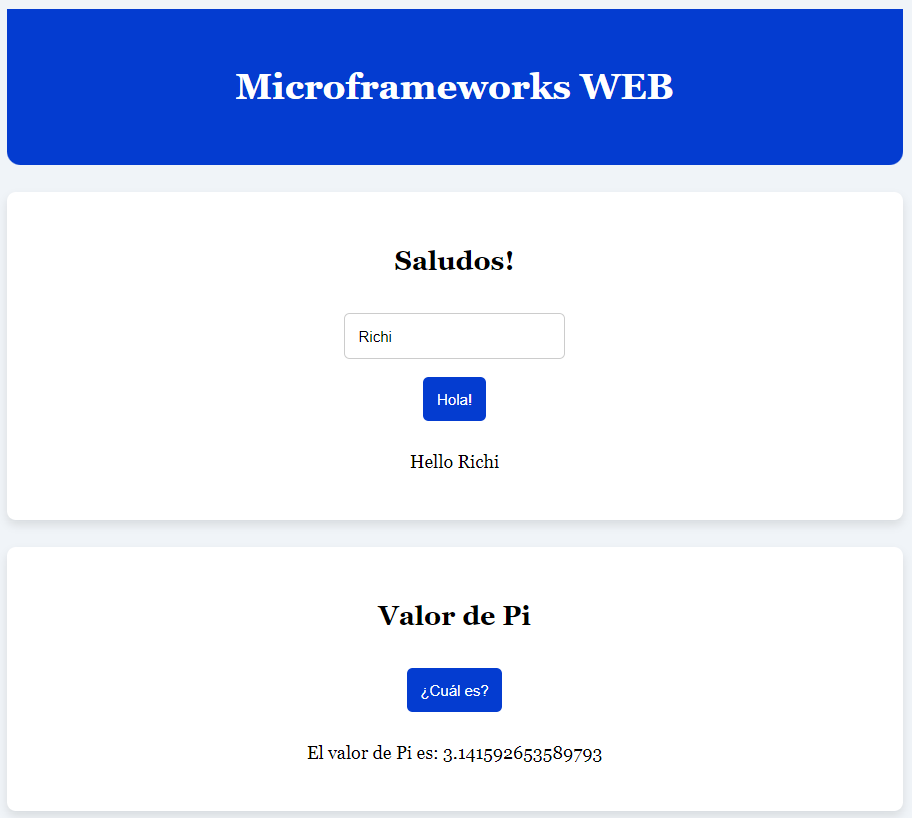
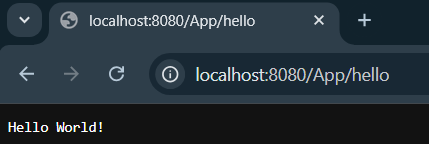

__<h1>Microframeworks WEB</h1>__
El objetivo del laboratio es crear un server de arquitectura con ayuda de un microframework.

<h2>Para comenzar</h2>
A continuación se encontrarán las instrucciones para obtener una copia del repositorio para poder ejecutar de manera local el server.

Para esto es necesario tener:
 1. Java Development Kit 11 o mayor
 2. Maven

__<h2> Instalación </h2>__
Para poder ejecutar lo presentado hay que:
1. Clonar el repositorio
> git clone https://github.com/RichiVilla/Microframeworks_.git
2. Navegar al proyecto
> cd Microframeworks_
3. Hacer el build del proyecto con Maven o ver si tenemos alguna versión instalada
> mvn clean install
> mvn -v
4. Correr la aplicación
> java -cp target/lab2-app-1.0-SNAPSHOT.jar edu.escuelaing.arem.ASE.app.App
5. Poder acceder al servidor por medio de un navegador web
> http://localhost:8080

__<h2> Tests </h2>__
Se pueden correr los tests de manera automática con Maven usando el siguiente comando
> mvn test

__<h2> Aplicación en funcionamiento </h2>__
Para acceder a la aplicación se puede hacer de la siguiente forma:
>http://localhost:8080/index.html

Dentro de ella se ofrecen los servicios de dar la bienvenida al usuario por medio de un geet request y de poder visualizar el valor del número Pi

__<h2> Visualización de la App </h2>__

*Visualización cuando se entra*

--------------

*Visualización al ejecutar los servicios*

--------------

*Prueba de los servicios*
